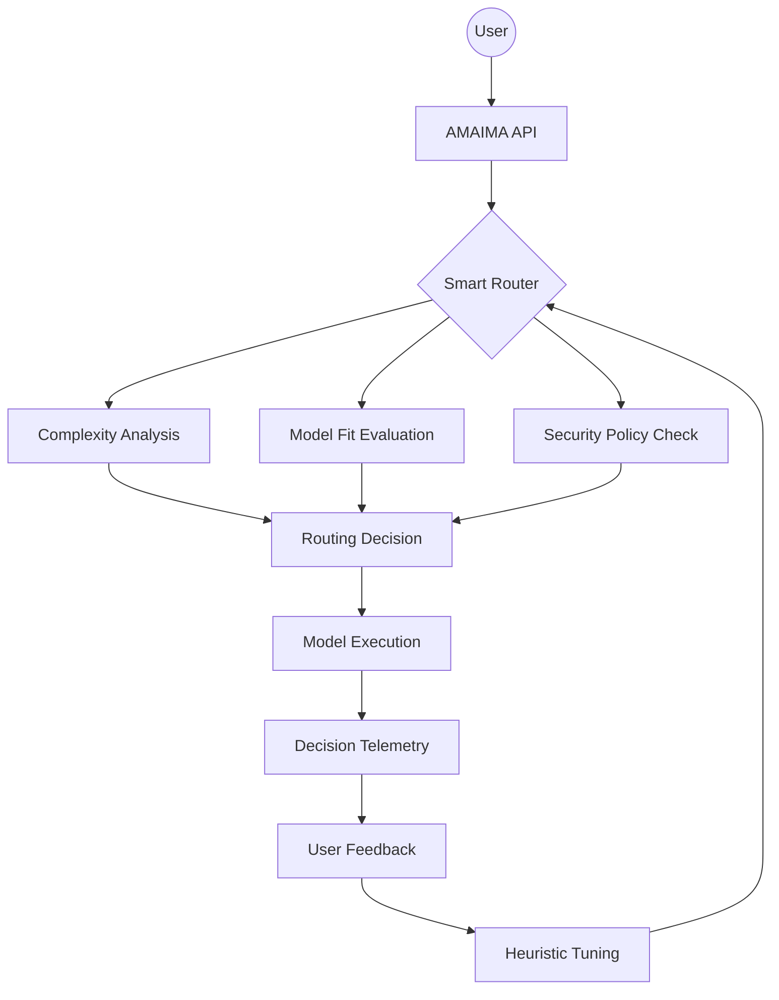

# AMAIMA Governance & Compliance

## Governance Diagram

## SOC2 / NIST Mapping
| Control ID | Control Name | AMAIMA Implementation |
|------------|--------------|------------------------|
| AC-2 | Account Management | Integrated Replit Auth |
| AU-2 | Event Logging | Decision Telemetry Schema |
| SC-7 | Boundary Protection | Smart Router Security Levels |
| SI-4 | Information System Monitoring | Real-time Health & Stats Endpoints |
